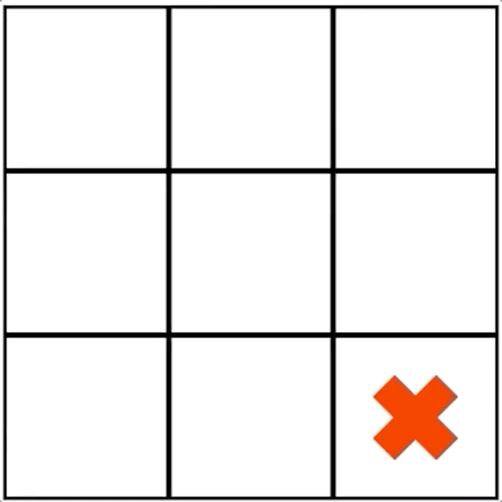
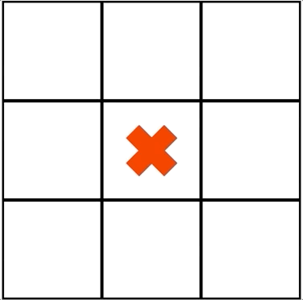
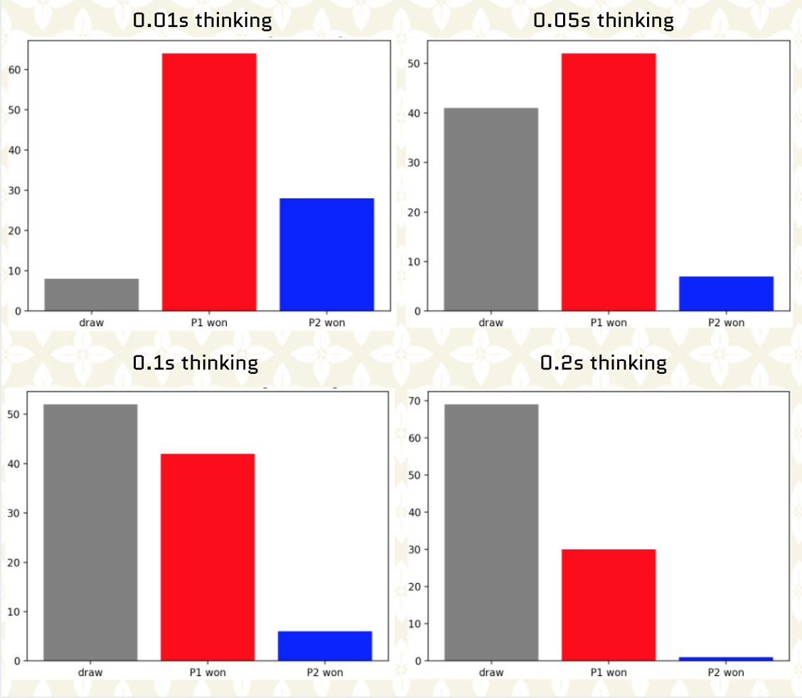
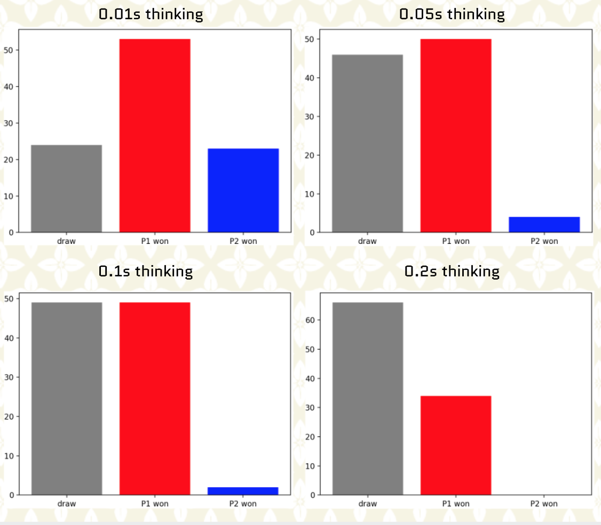
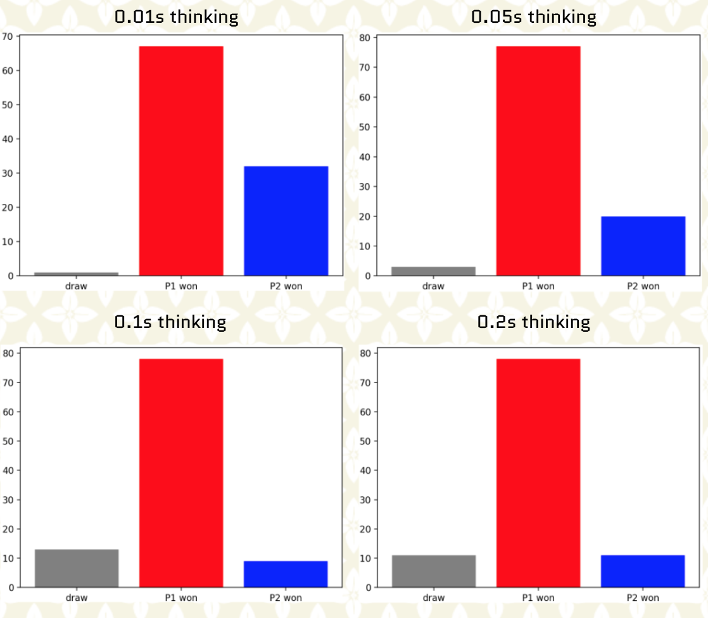
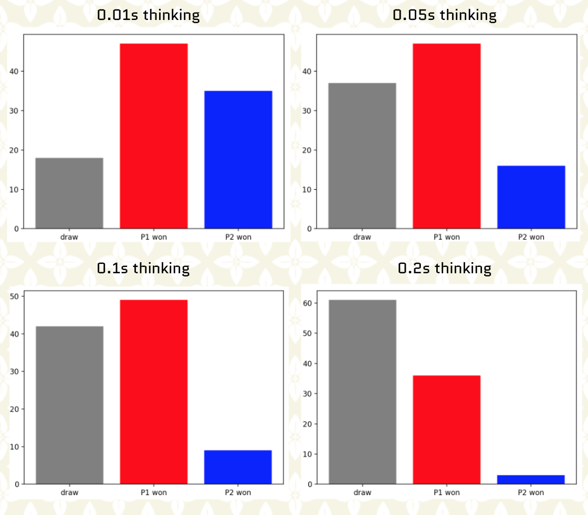

# Monte Carlo Tree Search

We implemented a Monte Carlo Tree Search (MCTS) from scratch and we successfully applied it to Tic-Tac-Toe game. 

We performed tests using different allocated time to build MCTS (thinking time). We also could test several symmetrical and asymmetrical reward designs.

Summary of steps of MCTS model:

* At each turn do:
  * during a time T, repeat the following steps:
    * create a Tree (root) where each node is associated to a state of game
    * select a leaf by UCB exploration
    * create a child node from this leaf
    * evaluate new state by roll out simulations
    * backpropagate from leaf to the root by updating visit count and reward at each node of the path

In our MCTS we used the following features:
* we used the following UCB for trees (UCT) formula with c = 1.4 :

 

* roll out simulations we performed by using random uniform policy

# Results

Here is a demo with 2 players using MCTS playing against each other. Allocated thinking time is **0.1s**. Reward designs are **symmetrical** with **reward(win)=3** and **reward(draw)=1**.

 

Here is a demo with 2 players using MCTS playing against each other. Allocated thinking time is **0.3s**. Reward designs are **symmetrical** with **reward(win)=3** and **reward(draw)=1**.

 

In the next figure we show the distribution of outcomes after we performed 100 games where we vary the allocated thinking time from 0.01s to 0.2s. Reward designs are **symmetrical** with **reward(win)=3** and **reward(draw)=1**. Player 1 is the player to play first while player 2 is the player to play second.

 

In the next figure we show the distribution of outcomes after we performed 100 games where we vary the allocated thinking time from 0.01s to 0.2s. Reward designs are **asymmetrical** with **reward_1(win)=3** and **reward_1(draw)=1** for player 1 (player to play first) and **reward_2(win)=1** and **reward_2(draw)=1** for player 2 (player to play second).

 

In the next figure we show the distribution of outcomes after we performed 100 games where we vary the allocated thinking time from 0.01s to 0.2s. Reward designs are **symmetrical** with **reward(win)=1** and **reward(draw)=0**. Player 1 is the player to play first while player 2 is the player to play second.

 

In the next figure we show the distribution of outcomes after we performed 100 games where we vary the allocated thinking time from 0.01s to 0.2s. Reward designs are **asymmetrical** with **reward_1(win)=1** and **reward_1(draw)=0** for player 1 (player to play first) and **reward_2(win)=1** and **reward_2(draw)=1** for player 2 (player to play second).

 

# Conclusion

From the previous plots we can make two observations: 

- Reward designs performance depend on thinking time

- Aggressive play is rewarded for player 1 when thinking time is low

- Looking for a draw   
