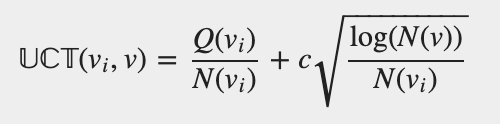

# Monte Carlo Tree Search

We implemented a Monte Carlo Tree Search (MCTS) from scratch and we successfully applied it to Tic-Tac-Toe game.

Summary of steps of MCTS model:

At each turn do:
  during a time T, repeat the following steps:
    * create a Tree (root) where each node is associated to a state of game
    * select a leaf by UCB exploration
    * create a child node from this leaf
    * evaluate new state by roll out simulations
    * backpropagate from leaf to the root by updating visit count and reward at each node of the path

In our MCTS we used the following features:
* we used the following UCB formula with c = 1.4 :

 

* roll out simulations we performed by using random uniform policy

# Results

We implemented Monte Carlo Tree Search with 

 

 

 

 

